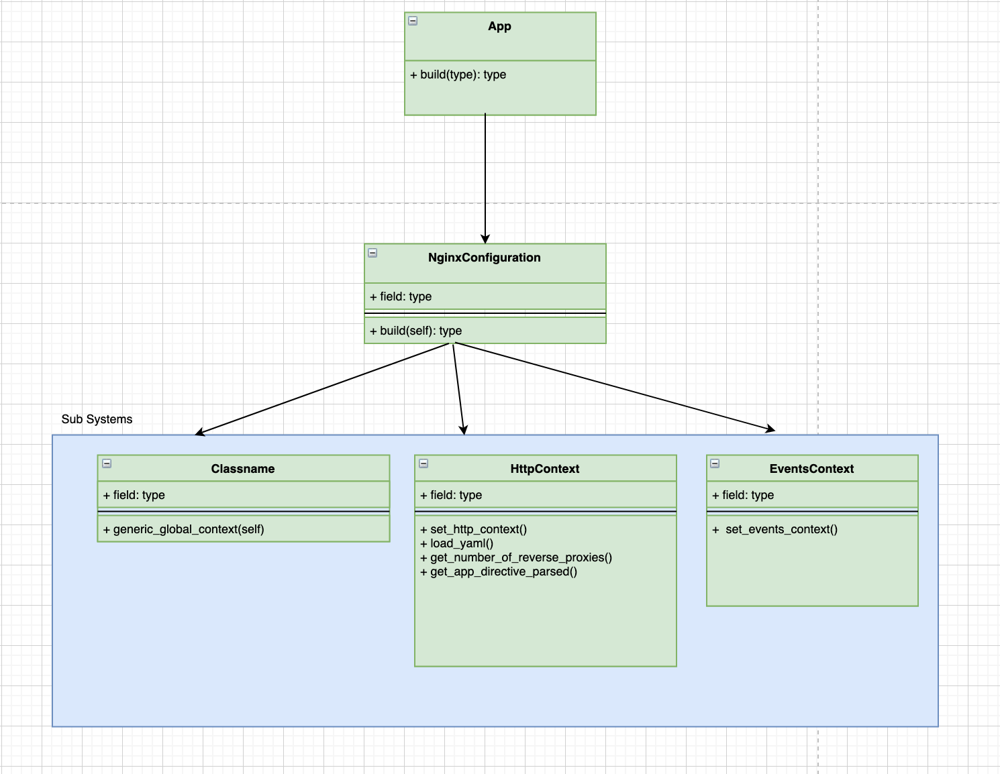

# Architecture Documentation

### High Level Documentation

### Different ideas that, I thought, but went ahead with the Approach 2 implementation.

## Approach 1
Task 1 
```text
1.1 Parsing the given YAML file.
1.2 Persisting the dictionary object and storing as Tables using pyton Marshmellow.
```

Task 2
```text
2.1 Building the classes for holding the different context of the Nginx Configuration.
2.2 Instantiating the class objects defined in 2.1 with the Table values created in Task 1.
2.3 Dumping the whole object as conf file.
```

## Approach 2
Task 1
```text
1.1 Parsing the given YAML file.
1.2 Persisting the dictionary object and storing as python pickle object.
```

Task 2
```text
2.1 Building the classes for holding the different context of the Nginx Configuration.
2.2 Storing the Entire configuration as a List and appending all the context to that list.  
2.3 Printing the List as the Nginx Configuration text.
```

## Approach 3
Task 1
```text
1.1 Parsing the given YAML file.
1.2 Persisting the dictionary object and storing as Tables using pyton Marshmellow.
```

Task 2
```text
2.1 Building the classes for holding the different context of the Nginx Configuration.
2.2 Instantiating the class objects defined in 2.1
2.3 Filling the jinja2 templates with the object values.
```


### Architecture Diagram
